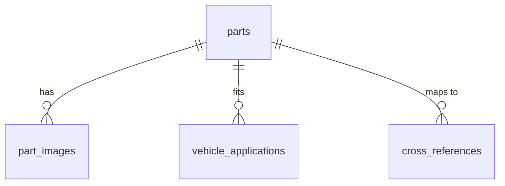

# Documentation Principles

## Core Philosophy: Ground Truth Only

All documentation must reflect **exactly what exists** in the codebase. This is non-negotiable.

Documentation is for learning and reference. It should help developers understand what the system does, why it exists, and how it works - based entirely on the actual implementation.

---

## Writing Tone & Audience

### Achieve Accessibility Through Clear Writing

Write documentation that is naturally accessible to junior developers and useful for interview preparation **without explicitly labeling it as such**.

**How to achieve this**:

- Use "What it is / Why it matters / How it works" structure
- Provide real-world context before diving into technical details
- Explain concepts in plain English before introducing jargon
- Include concrete code examples with file paths
- Show the "why" behind architectural decisions

**What NOT to do**:

- ❌ "For junior developers: This section explains..."
- ❌ "For interviews: You can explain this by..."
- ❌ "Note: This is targeted at beginners..."
- ❌ Skill level callouts or audience labels

**Example - Good**:

````markdown
### Batch Fetching (N+1 Prevention)

**What it is**: Fetch all related data in one query instead of one query per item.

**Why it matters**: The N+1 problem makes 16 queries for 15 items (1 for the list + 15 for images). Batching makes 2 queries total (1 for list + 1 for all images).

**How it works**:

```typescript
// File: src/app/api/public/parts/route.ts (lines 15-22)
const partIds = parts.map((p) => p.id);
const { data: images } = await supabase
  .from("part_images")
  .in("part_id", partIds); // ✅ 1 query for all parts
```
````

````

**Example - Bad**:
```markdown
### Batch Fetching

**For junior developers**: This technique prevents the N+1 problem, which is a common performance issue...

**For interviews**: You can explain this by showing how we use `.in()` instead of `.eq()`...
````

---

## Content Rules

### MUST Include

Every documentation file should contain (adapt as needed):

1. **Big Picture** - What the feature does, why it exists, real-world context
2. **Core Technicals** - Architecture, implementation details, how it actually works
3. **Real Code Examples** - Snippets from actual codebase with file paths and line numbers
4. **Diagrams** - Visual explanations when they clarify complex concepts (not decoration)
5. **Verification** - How to confirm the feature works (basic smoke tests, not exhaustive troubleshooting)

#### Big Picture Sections

Big picture sections (Overview, Strategy, Philosophy, etc.) should provide substantive context:

**Guidelines**:

- **Provide enough detail** for readers to understand the "why" and "what" before diving into code
- **Include real-world examples** - actual usage patterns, user behaviors, production scenarios
- **Set up mental models** - explain the thinking behind design decisions
- **Be substantive** - aim for 2-4 paragraphs per major concept, not just bullet points
- **Connect to user needs** - explain how the feature serves real-world requirements

**Good example**:

```markdown
### Core Optimization Philosophy

We optimize for real-world usage patterns observed in production. Most searches (approximately 80%) are exact ACR SKU lookups where users scan a barcode or copy-paste a part number from a customer order. These need to be instant - parts counter staff are helping customers in real-time and any delay impacts the sale.

The remaining searches fall into two categories: competitor SKU lookups (15%) where staff receive a part from another manufacturer and need to find the ACR equivalent, and typo-tolerant searches (5%) where someone manually types a part number and makes a small mistake.

This usage pattern drives our cascade architecture: optimize the common case (exact matches) to be lightning-fast, make the less common cases (competitor lookups) acceptable, and ensure edge cases (typos) still work but don't need to be as fast. We achieve this through early termination - if Stage 1 finds an exact match, we never run Stages 2-6.
```

**Bad example** (too terse):

```markdown
### Core Optimization Philosophy

We optimize for:

- Exact matches (most common)
- Competitor SKU lookups
- Fuzzy matching (fallback)
```

### MUST NOT Include

The following content types belong elsewhere, NOT in feature documentation:

1. ❌ **Troubleshooting sections** - Operational knowledge belongs in runbooks (`.claude/skills/document-runbook`)
2. ❌ **Future work sections** - Planning content belongs in `docs/TASKS.md` or `docs/ENHANCEMENTS.md`
3. ❌ **Empty benchmark sections** - If metrics don't exist, omit the section entirely (don't add "TBD" or "Coming soon")
4. ❌ **Meta-commentary** - No "Note:", "Future work:", "For developers:", "This will be...", etc.
5. ❌ **Estimated metrics** - Only include measurements you've actually taken
6. ❌ **Audience callouts** - No skill level labels or "this is for X audience" markers
7. ❌ **Hypothetical examples** - Only use real code from the codebase

---

## Performance Documentation

Performance docs require special care to avoid speculation. Follow these rules:

### Document Techniques Used

Show the actual optimization techniques implemented in the codebase:

**Examples**:

- Database indexes (show `CREATE INDEX` statements from migrations)
- Caching strategies (show cache configuration from code)
- Batch operations (show `.in()` vs `.eq()` patterns from actual files)
- Early termination (show `IF FOUND THEN RETURN; END IF;` logic)
- Query optimization (show SQL from database functions)

````markdown
### Trigram Indexing for Fuzzy Matching

We use PostgreSQL's `pg_trgm` extension to enable fast fuzzy searches:

```sql
-- File: supabase/migrations/initial_schema.sql (lines 103-104)
CREATE INDEX parts_acr_sku_trgm_idx ON parts USING gin (acr_sku gin_trgm_ops);
CREATE INDEX cross_references_competitor_sku_trgm_idx ON cross_references USING gin (competitor_sku gin_trgm_ops);
```
````

**How it works**: Trigram indexes split text into 3-character sequences. When searching for "ACR2303004", it matches similar patterns even with typos.

````

### Show How to Measure

Provide commands or code snippets that allow developers to measure performance themselves:

**Good examples**:
```markdown
To measure query performance:
```sql
EXPLAIN ANALYZE SELECT * FROM search_by_sku('ACR2303004');
````

To measure API response time:

```typescript
const start = performance.now();
const result = await fetch("/api/public/parts?sku=ACR2303004");
console.log(`Response time: ${performance.now() - start}ms`);
```

````

### DO NOT Estimate Timings

Never include estimated or projected performance numbers unless you've actually measured them:

**❌ Bad examples**:
- "Stage 1: 50-100ms (99% of searches)"
- "Average response time: 120-150ms"
- "This should improve performance by 3x"
- "Target: Sub-300ms ✅ Achieved"

**✅ Good examples**:
- "Stage 1 uses an indexed lookup on `acr_sku_normalized`"
- "Use `EXPLAIN ANALYZE` to measure query time"
- "This uses batch fetching (`.in()`) instead of N+1 queries"
- "Future work: Add performance logging to measure production query times"

### If No Metrics Exist

If you haven't measured performance yet, either:

**Option 1**: Omit the benchmarks section entirely
```markdown
## Performance Techniques

[Document actual techniques used]

## How to Measure

[Show measurement commands]
````

**Option 2**: Clearly state metrics don't exist and show how to add them

```markdown
> **Note**: No production metrics tracking exists yet. To add performance monitoring, see "Future Work" in `docs/ENHANCEMENTS.md`.
```

---

## Code Examples

All code examples must be verifiable and traceable to the actual codebase.

### Requirements

Every code example must:

1. **Be real code** - Copy from actual files, don't write hypothetical examples
2. **Include file path** - Show where in the codebase this code lives
3. **Show context** - Include enough surrounding code to understand what's happening

### Format

Use this format consistently:

````markdown
```typescript
// File: src/hooks/api/public/parts.ts
staleTime: 5 * 60 * 1000,  // 5 minutes - data considered fresh
gcTime: 10 * 60 * 1000,    // 10 minutes - keep in memory
```
````

````

### Examples

**✅ Good - Real code with context**:
```markdown
We use TanStack Query's caching to avoid redundant API calls:

```typescript
// File: src/hooks/api/public/parts.ts
return useQuery<{ data: PartSearchResult[]; count: number }>({
  queryKey,
  queryFn: async () => {
    const searchParams = new URLSearchParams();
    if (make) searchParams.set("make", make);
    if (model) searchParams.set("model", model);
    // ... fetch logic
  },
  staleTime: 5 * 60 * 1000,  // 5 minutes
  gcTime: 10 * 60 * 1000,    // 10 minutes
});
````

**Configuration**:

- `staleTime`: How long data is considered fresh (5 minutes)
- `gcTime`: How long unused data stays in memory (10 minutes)

```

```

**❌ Bad - Hypothetical code**:

````markdown
You can configure caching like this:

```typescript
useQuery({
  staleTime: 300000,
  cacheTime: 600000,
});
```
````

````

---

## Diagrams

Use Mermaid diagrams to clarify complex concepts, not for decoration.

### When to Use Diagrams

**✅ Use diagrams when they help visualize**:
- System architecture (how components connect)
- Data flow (how data moves through the system)
- Process sequences (step-by-step operations)
- Database relationships (table connections)
- State transitions (how state changes)

**❌ Don't use diagrams for**:
- Simple concepts that are clear in text
- Decoration or visual filler
- Content that's easier to explain in a bullet list

### Mermaid Standards

Use these Mermaid diagram types:

**Architecture diagrams**:
```mermaid
graph TD
    Client[Next.js Client]
    API[API Route]
    DB[(Supabase)]

    Client -->|Search Request| API
    API -->|Query| DB
    DB -->|Results| API
    API -->|JSON| Client
````

**Sequence diagrams** (for data flow):

```mermaid
sequenceDiagram
    participant User
    participant API
    participant DB

    User->>API: GET /api/public/parts?sku=ACR2303004
    API->>DB: search_by_sku('ACR2303004')
    DB-->>API: Part data (no images)
    API->>DB: Batch fetch images for part IDs
    DB-->>API: Image data
    API-->>User: Enriched results with images
```

**Entity relationship diagrams** (for database):



### Include Legends for Complex Diagrams

If your diagram uses colors, symbols, or non-obvious notation, include a legend:

```markdown
**Legend**:

- Solid arrows → Synchronous calls
- Dashed arrows → Async operations
- Cylinders → Database tables
- Rectangles → API endpoints
```

---

## Diátaxis Framework Integration

These principles work **alongside** the Diátaxis framework, not instead of it.

**Diátaxis tells you WHAT type of doc to write**:

- Tutorial (learning-focused, step-by-step)
- How-To Guide (task-focused, problem-solving)
- Reference (technical specs, API docs)
- Explanation (conceptual understanding)

**These principles tell you HOW to write it**:

- Ground truth only (no speculation)
- Clear writing without meta-commentary
- Real code examples with file paths
- Diagrams when helpful
- No troubleshooting or future work

**Example**:

- Diátaxis: "Write a How-To Guide for implementing search filtering"
- Principles: "Use real code from `route.ts:42`, don't estimate timings, write clearly without saying 'for junior devs'"

---

## Summary

When writing documentation:

✅ **DO**:

- Document exactly what exists in the codebase
- Write clearly using "What / Why / How" structure
- Include real code with file paths and line numbers
- Use diagrams to clarify complex concepts
- Show how to measure performance (don't estimate it)
- Provide real-world context and examples

❌ **DON'T**:

- Estimate metrics or performance timings
- Add audience callouts ("For junior developers")
- Include troubleshooting sections (put in runbooks)
- Add "Future work" sections (put in TASKS.md/ENHANCEMENTS.md)
- Use meta-commentary ("Note: We don't...")
- Write hypothetical code examples
- Add diagrams for decoration

**Result**: Documentation that is accurate, clear, and useful for learning and interviews - without explicitly saying so.
