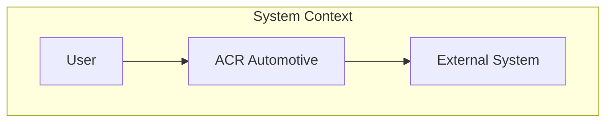

# Architecture Documentation Skill

## Instructions

When documenting system architecture:

1. **Explore the entire codebase** to understand the system
2. **Follow Arc42 template** structure (12 sections)
3. **Generate C4 diagrams** in Mermaid at all 4 levels
4. **Document all architectural decisions** or link to ADRs
5. **Output to** `/docs/architecture/[system].md`

## Arc42 Template Structure

All architecture docs MUST include these sections:

```markdown
# [System Name] Architecture

## 1. Introduction and Goals

### Requirements Overview

Brief description of functional requirements

### Quality Goals

| Priority | Goal        | Scenario                  |
| -------- | ----------- | ------------------------- |
| 1        | Performance | Sub-300ms search response |
| 2        | Usability   | Mobile-first design       |

### Stakeholders

| Role                | Expectations     |
| ------------------- | ---------------- |
| Parts counter staff | Fast part lookup |

## 2. Constraints

### Technical Constraints

- Next.js App Router
- Supabase backend
- TypeScript strict mode

### Organizational Constraints

- Open source only
- Single developer maintenance

## 3. Context and Scope

### Business Context

[Mermaid C4 Context diagram]

### Technical Context

[Mermaid diagram showing external interfaces]

## 4. Solution Strategy

Key technology decisions and their rationale

## 5. Building Block View

### Level 1: System Context

[C4 Context diagram]

### Level 2: Containers

[C4 Container diagram]

### Level 3: Components

[C4 Component diagram for key containers]

## 6. Runtime View

### Primary Use Case: [Name]

[Sequence diagram showing runtime behavior]

## 7. Deployment View

[Deployment diagram showing infrastructure]

- Production: Vercel
- Database: Supabase
- Storage: Supabase Storage

## 8. Crosscutting Concepts

### Security

Authentication and authorization approach

### Logging

Error tracking and monitoring

### Error Handling

Global error handling patterns

### Internationalization

i18n implementation

## 9. Architecture Decisions

Link to ADRs in `/docs/decisions/`

| ADR | Title        | Status   |
| --- | ------------ | -------- |
| 001 | Use Supabase | Accepted |

## 10. Quality Requirements

### Quality Tree
```

Quality
├── Performance
│ └── Search < 300ms
├── Usability
│ └── Mobile-first
└── Maintainability
└── Type-safe

```

### Quality Scenarios
| Scenario | Metric | Target |
|----------|--------|--------|
| Part search | Response time | < 300ms |

## 11. Risks and Technical Debt

### Known Risks
| Risk | Mitigation |
|------|------------|
| ... | ... |

### Technical Debt
| Item | Priority | Plan |
|------|----------|------|
| ... | ... | ... |

## 12. Glossary
| Term | Definition |
|------|------------|
| SKU | Stock Keeping Unit |
| OEM | Original Equipment Manufacturer |
```

## C4 Diagram Standards

Use Mermaid with C4 naming conventions:



## Quality Checklist

Before completing:

- [ ] All 12 Arc42 sections present
- [ ] C4 diagrams at context, container, component levels
- [ ] At least one runtime sequence diagram
- [ ] Links to existing ADRs
- [ ] Glossary with domain terms

## Examples

- "Document the system architecture" -> Creates `/docs/architecture/OVERVIEW.md`
- "Create architecture docs for the search system" -> Creates `/docs/architecture/SEARCH_ARCHITECTURE.md`
