# [System Name] Architecture

> **Doc Type**: Explanation (Architecture) | **Framework**: Arc42 + C4

---

## 1. Introduction and Goals

### Requirements Overview

[Brief description of what this system/component does and its core functionality]

### Quality Goals

| Priority | Goal                | Scenario              |
| -------- | ------------------- | --------------------- |
| 1        | [Quality attribute] | [Measurable scenario] |
| 2        | [Quality attribute] | [Measurable scenario] |
| 3        | [Quality attribute] | [Measurable scenario] |

### Stakeholders

| Role        | Expectations                     |
| ----------- | -------------------------------- |
| [User type] | [What they need from the system] |
| [User type] | [What they need from the system] |

---

## 2. Constraints

### Technical Constraints

- [Framework/language constraint]
- [Infrastructure constraint]
- [Integration constraint]

### Organizational Constraints

- [Team/resource constraint]
- [Timeline constraint]
- [Budget/licensing constraint]

### Conventions

- [Coding standard]
- [Documentation standard]
- [Process convention]

---

## 3. Context and Scope

### Business Context

```mermaid
graph TB
    subgraph "System Context"
        User[👤 User]
        System[🖥️ System Name]
        External1[📦 External System 1]
        External2[📦 External System 2]
    end

    User -->|"Uses"| System
    System -->|"Fetches data"| External1
    System -->|"Sends events"| External2
```



| Actor/System      | Description   | Interface |
| ----------------- | ------------- | --------- |
| User              | [Description] | Web UI    |
| External System 1 | [Description] | REST API  |
| External System 2 | [Description] | Webhooks  |

### Technical Context


---

## 4. Solution Strategy

| Goal           | Approach                 | Technology  |
| -------------- | ------------------------ | ----------- |
| [Quality goal] | [Strategy to achieve it] | [Tech used] |
| [Quality goal] | [Strategy to achieve it] | [Tech used] |

### Key Decisions

- **[Decision area]**: [Choice made and brief rationale]
- **[Decision area]**: [Choice made and brief rationale]

> **See Also**: [ADR-001: Decision Name](../decisions/0001-decision.md)

---

## 5. Building Block View

### Level 1: System Context (C4)

```mermaid
graph TB
    subgraph "System Context"
        U[👤 User]
        S[🖥️ System]
        E1[📦 External 1]
        E2[📦 External 2]
    end

    U --> S
    S --> E1
    S --> E2
```



### Level 2: Containers (C4)

```mermaid
graph TB
    subgraph "Containers"
        Web[🌐 Web App<br/>Next.js]
        API[⚙️ API Routes<br/>Next.js API]
        DB[(🗄️ Database<br/>PostgreSQL)]
        Storage[📁 Storage<br/>S3-compatible]
    end

    Web --> API
    API --> DB
    API --> Storage
```



| Container  | Technology    | Purpose          |
| ---------- | ------------- | ---------------- |
| Web App    | Next.js       | User interface   |
| API Routes | Next.js API   | Business logic   |
| Database   | PostgreSQL    | Data persistence |
| Storage    | S3-compatible | File storage     |

### Level 3: Components (C4)


| Component      | Purpose                        | Key Files              |
| -------------- | ------------------------------ | ---------------------- |
| Auth           | Authentication & authorization | `src/lib/auth/`        |
| Parts Service  | CRUD operations                | `src/services/parts/`  |
| Search Service | Full-text search               | `src/services/search/` |
| Import Service | Data import                    | `src/services/import/` |

---

## 6. Runtime View

### Scenario: [Primary Use Case]


### Scenario: [Secondary Use Case]


---

## 7. Deployment View

```mermaid
graph TB
    subgraph "Production"
        Vercel[☁️ Vercel<br/>Edge Network]
        Supabase[🐘 Supabase<br/>PostgreSQL + Storage]
    end

    subgraph "Development"
        Local[💻 Local Dev<br/>Docker]
    end

    Vercel --> Supabase
    Local -.->|"Mirrors"| Supabase
```



### Environments

| Environment | URL            | Purpose                |
| ----------- | -------------- | ---------------------- |
| Production  | [URL]          | Live system            |
| Staging     | [URL]          | Pre-production testing |
| Development | localhost:3000 | Local development      |

### Infrastructure

| Component | Provider         | Configuration   |
| --------- | ---------------- | --------------- |
| Hosting   | Vercel           | Pro plan        |
| Database  | Supabase         | [Tier]          |
| Storage   | Supabase Storage | [Bucket config] |

---

## 8. Crosscutting Concepts

### Authentication & Authorization

[Describe auth approach]

```typescript
// Example auth pattern
```

### Error Handling

[Describe error handling strategy]

```typescript
// Example error handling
```

### Logging & Monitoring

[Describe logging approach]

### Internationalization

[Describe i18n approach]

### Caching Strategy

[Describe caching approach]

---

## 9. Architecture Decisions

| ADR | Title      | Status   | Link                                  |
| --- | ---------- | -------- | ------------------------------------- |
| 001 | [Decision] | Accepted | [Link](../decisions/0001-decision.md) |
| 002 | [Decision] | Accepted | [Link](../decisions/0002-decision.md) |

---

## 10. Quality Requirements

### Quality Tree

```
Quality
├── Performance
│   ├── Response time < 300ms
│   └── Page load < 2s
├── Usability
│   ├── Mobile-first
│   └── Accessible (WCAG 2.1)
├── Reliability
│   └── 99.9% uptime
└── Maintainability
    ├── Type-safe
    └── Documented
```

### Quality Scenarios

| ID  | Quality     | Scenario               | Metric          | Target  |
| --- | ----------- | ---------------------- | --------------- | ------- |
| Q1  | Performance | User searches for part | Response time   | < 300ms |
| Q2  | Usability   | New user finds part    | Time to success | < 1 min |
| Q3  | Reliability | System under load      | Uptime          | 99.9%   |

---

## 11. Risks and Technical Debt

### Risks

| Risk   | Probability | Impact | Mitigation |
| ------ | ----------- | ------ | ---------- |
| [Risk] | Medium      | High   | [Strategy] |
| [Risk] | Low         | Medium | [Strategy] |

### Technical Debt

| Item        | Priority | Impact   | Plan              |
| ----------- | -------- | -------- | ----------------- |
| [Debt item] | High     | [Impact] | [Resolution plan] |
| [Debt item] | Medium   | [Impact] | [Resolution plan] |

---

## 12. Glossary

| Term             | Definition              |
| ---------------- | ----------------------- |
| [Domain term]    | [Definition]            |
| [Technical term] | [Definition]            |
| [Acronym]        | [Full form and meaning] |

---

## Related Documentation

- [Feature docs](../features/)
- [API Reference](../reference/api/)
- [ADRs](../decisions/)

---

_Last updated: YYYY-MM-DD_
