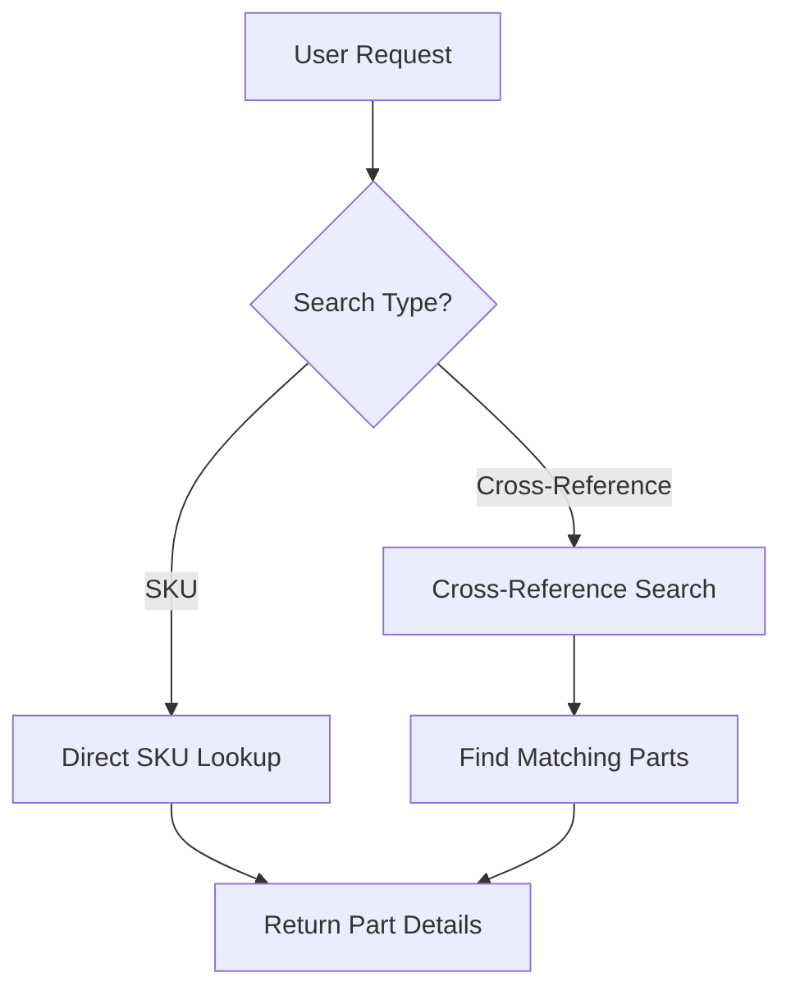
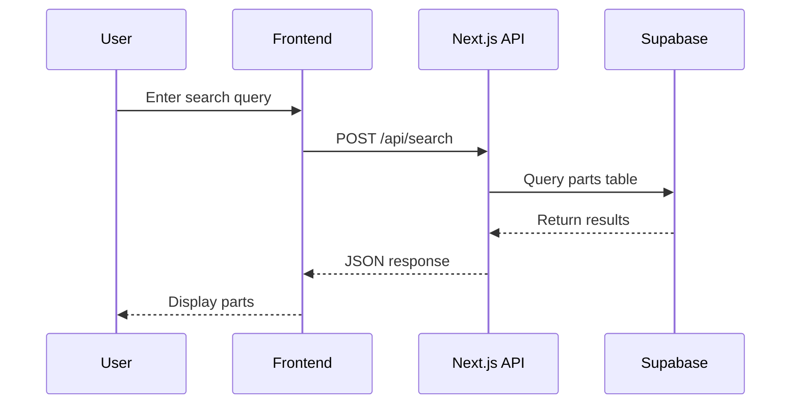
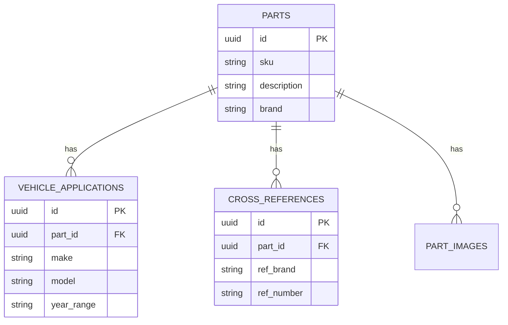
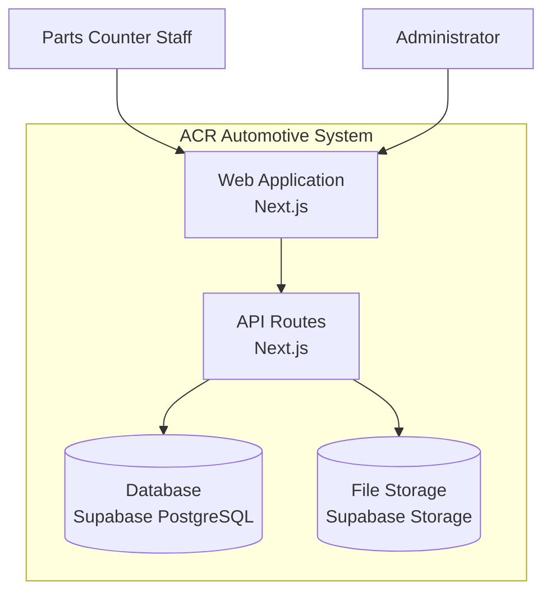
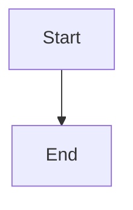

# Diagram Examples

This page demonstrates Mermaid diagram support in our documentation.

## Flowchart Example



## Sequence Diagram Example



## Entity Relationship Diagram



## C4 Context Diagram Style



## Usage

To add a diagram to any documentation page, use a mermaid code block:

````markdown

````

The diagram will automatically render with theme support (light/dark mode).
